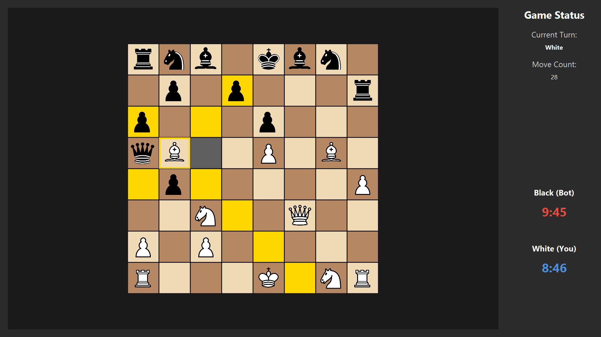
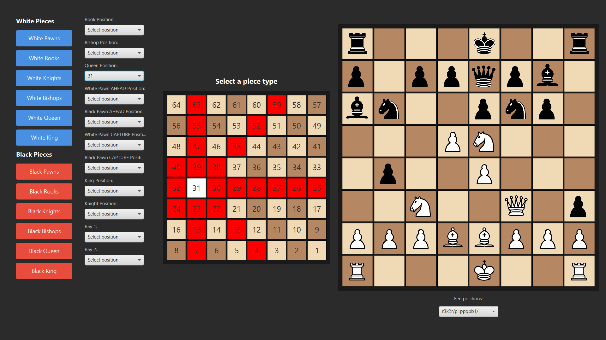
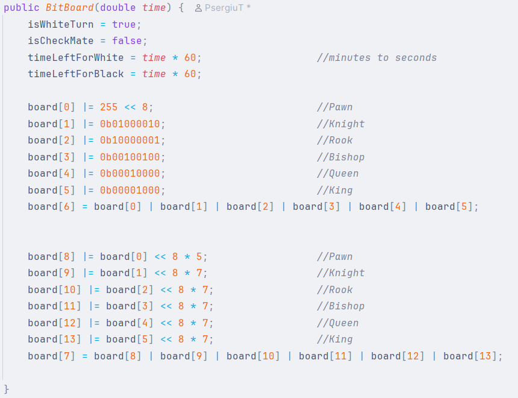
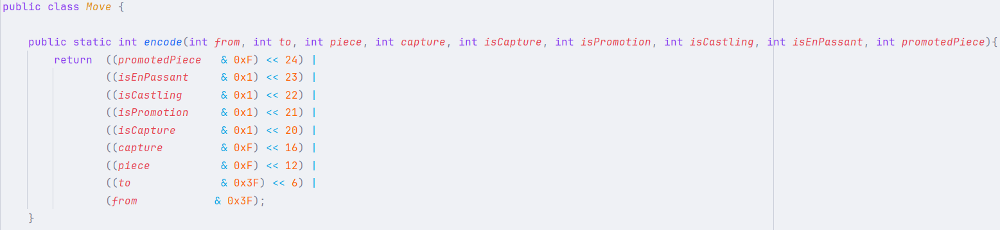
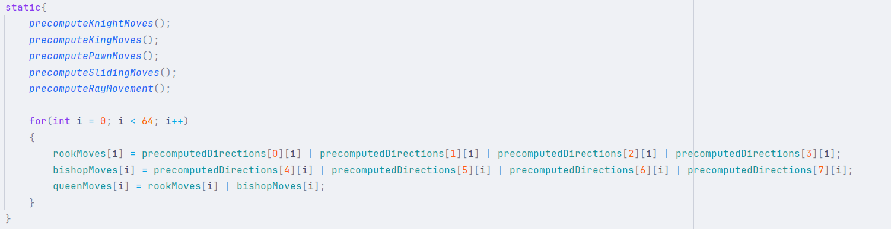
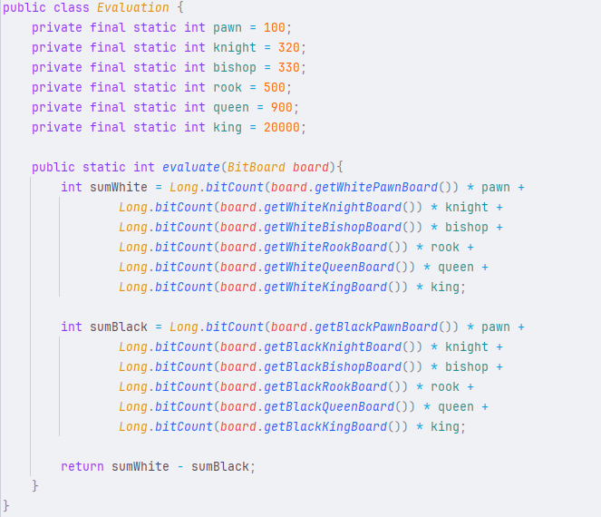
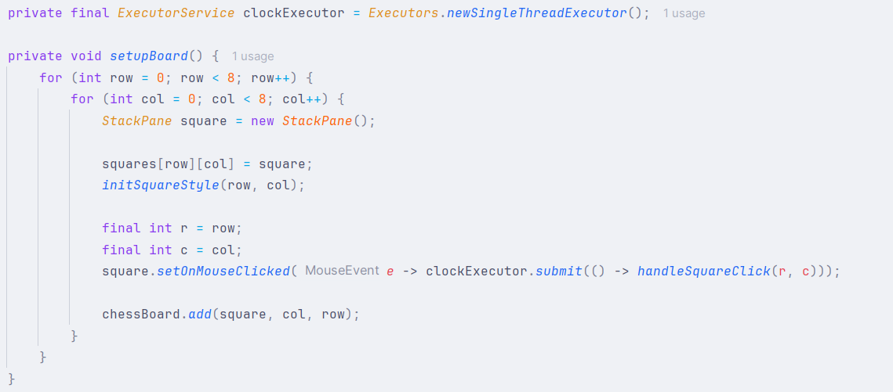

# Chess Bot

This project is a high-performance, custom-built Chess Engine implemented in Java. It features an optimized bitboard representation, move generator, and search algorithms for the bot implementations.
I chose this project idea because I wanted to build a strong foundation in the java architecture and memory optimization.

    
    

## Features & Architecture

### BitBoard Representation
The core of the chess engine is the `BitBoard` class. To optimize performance and minimize memory usage, the board state is implemented using 64-bit `long` primitives. 
- **Board Representation**: The `BitBoard` class is a lightweight representation of the chess board. It consists of a series of variables for game state tracking and a 12-element array of longs for piece tracking (pieces: Pawn, Rook, Knight, Bishop, Queen, King | 6 - for individual white pieces, 6 - for individual black pieces and 2 - for all white and black pieces).
- **64-bit Piece Mapping**: Each bit in a 64-bit long corresponds to a specific square on the 8x8 chess board (64 squares). A bit set to `1` indicates the presence of a piece, while `0` indicates the absence of that piece.
- **Make Move Method**: By leveraging bitwise operations (AND, OR, XOR, and bit shifting), the engine can perform ultra-fast operations, without the massive overhead of object instantiation and garbage collection. This method is responsible for physically moving the piece on the board (given a specified Move) while preserving a legal game state. It checks for EnPassant square, captures, castling and promotions.
- **State Preservation**: The `BitBoard` efficiently handles game state preservation (`makeMove` and `undoMove`) using a small memory footprint. It stores necessary historical data (castling rights, en passant squares, half-move clock) in an array (`savedBoardState`) for efficient implementation of the undo method.

--------------------------------------------------------------------------------------

### Move Encoding (`Move`)
The `Move` class is a collection of static methods efficiently encoding and decoding a move action inside a 32-bit `int`. It stores the starting and ending squares, the piece moved, any captured piece, any promotion piece, and some extra flags. This encoding is crucial for optimizing the search algorithms, as it allows for efficient storage and retrieval of move information.

--------------------------------------------------------------------------------------

### Move Generation(`MoveGenerator`)
The `MoveGenerator` is a highly optimized engine component responsible for generating all legal moves for a given board state.
- **Precomputed Movements**: To avoid expensive calculations during the search tree traversal, `PrecomputeMoves` class precomputes movement capabilities (pawn captures and moves, knight jumps, king steps, and sliding piece rays for rooks, bishops and queen) for every square on the board during class initialization.
- **Masks**: The `calculateCheckMask` is used to calculate the check mask (used to determine the only available positions that an ally piece can move to in case of check) for a given board state. The `calculatePinnedMask` method calculates the mask for the pinned pieces (pieces that cannot be moved because it will result in a check)
- **Move Generation**: At runtime, generating moves consists of calculating check masks and pinned piece masks and then masking the precomputed rays with the occupied squares to quickly extract valid destination squares. As it generates moves, it adds them to a custom MoveList that will be later used to make decisions in the search tree.

--------------------------------------------------------------------------------------

### Bot Implementations & Search
The project contains different implementations of the bot to allow for iterative improvements in the evaluation and search algorithms.
- **search/BotV1**: The initial version of the chess-playing algorithm uses random moves to test how the MoveGenerator works.
- **search/BotV2**: This version of the bot includes an `Evaluation` class and more robust recursive search mechanisms (Minimax algorithm) to find the absolute best move at a given depth. The evaluation process is based on given piece values, so the bot will prioritize captures and promotions.
- **Perft (Performance Test) Interface**: Located in the search module, is a crucial debugging and verification tool. It generates the total number of possible board permutations up to a specific depth and compares them against the known outputs (stored in test/files/expected.csv). This guarantees that `MoveGenerator` handles complex scenarios (pins, en passant, castling and promotions). I also used it to benchmark the engine, and it reached a speed of 150 million moves per second.

--------------------------------------------------------------------------------------

### UI & Controllers
The Graphical User Interface is built using JavaFX to provide an interactive and responsive interface for the user.

- **Interfaces**: There are three available interfaces:
  - `PlayerVsBotApplication` (used if the client wants to play against BotV2), 
  - `BotVsBotApplication` (used if the client wants to see BotV1 play against BotV2)
  - `TestBoardApplication` (used for testing precomputed rays and moves and for testing Fen strings).
- **Responsiveness**: 
  - In `BotVsBotController` I am creating a new thread responsible for the engine calculations and with the help of the method `runLater(Runnable runnable)` from the `Platform` class I can keep the UI responsive as the engine calculates the next move in the background.
  - `PlayerVsBotController` uses a different approach because the method `handleSquareClick(int row,  int col)` only runs when a click event happens, so I can't keep the method running all the time. To navigate around this problem, I am using the `ExecutorService` interface to create a new `Executors.newSingleThreadExecutor()`. By doing this every time the click is pressed the Thread wakes up and runs the method `handleSquareClick(int row,  int col)`.

